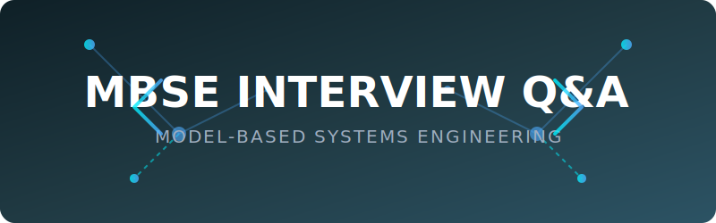

# Awesome Model-Based Systems Engineer (MBSE) Interview Q&A 🧬📐🔧

<div align="center">
  
</div>

<a href="https://github.com/ishandutta2007/Awesome-Awesome-Awesome"></a><a href="https://discord.gg/jc4xtF58Ve"></a>
[](https://awesome.re)
[](CONTRIBUTING.md)
[](LICENSE)

A comprehensive and curated collection of **Model-Based Systems Engineering (MBSE) interview questions with answers**, organized by topic. Whether you are preparing for a role as a **Systems Engineer**, **MBSE Engineer**, **Systems Architect**, or focusing on **SysML** and **Digital Engineering** across aerospace, defense, automotive, and complex industrial systems, this guide is your ultimate resource. It also serves as an excellent reference for interviewers building robust **MBSE** and **Systems Engineering** question banks.

> 📎 **Scope note:** MBSE replaces (or augments) traditional document-centric systems engineering with a **formal, connected model** as the authoritative source of truth for requirements, architecture, behavior, and verification — typically expressed in SysML/UML and managed through the system lifecycle in a Digital Engineering ecosystem. This repo covers the methodology, the modeling languages, the verification/validation discipline built around the model, and the practical tooling/organizational realities of adopting MBSE in a real program.

Every answer aims to be **concise, correct, and interview-ready** — the kind of answer that would actually land well in a 45-minute technical round, not a textbook chapter.

> ⭐ Star this repo if it helps your prep. PRs adding new questions, fixing answers, or improving explanations are very welcome — see [CONTRIBUTING.md](CONTRIBUTING.md).

---

## 📚 Table of Contents

| # | Topic | Questions | Difficulty Mix |
|---|-------|-----------|-----------------|
| 01 | [Systems Engineering Fundamentals & MBSE Overview](topics/01-systems-engineering-mbse-overview.md) | 11 | Easy → Medium |
| 02 | [SysML Fundamentals & Diagram Types](topics/02-sysml-fundamentals-diagrams.md) | 12 | Easy → Hard |
| 03 | [Requirements Engineering & Traceability](topics/03-requirements-engineering-traceability.md) | 10 | Medium → Hard |
| 04 | [System Architecture & Design Modeling](topics/04-system-architecture-design-modeling.md) | 9 | Medium → Hard |
| 05 | [Behavioral Modeling (State Machines, Activity, Sequence)](topics/05-behavioral-modeling.md) | 10 | Medium → Hard |
| 06 | [Simulation & Executable MBSE](topics/06-simulation-executable-mbse.md) | 9 | Medium → Hard |
| 07 | [Verification, Validation & V&V Planning](topics/07-verification-validation.md) | 10 | Medium → Hard |
| 08 | [Interface Management & System Integration](topics/08-interface-management-integration.md) | 10 | Medium → Hard |
| 09 | [MBSE Tools & Ecosystem](topics/09-mbse-tools-ecosystem.md) | 9 | Easy → Medium |
| 10 | [Model Management, Configuration & Version Control](topics/10-model-management-configuration.md) | 9 | Medium → Hard |
| 11 | [Systems Engineering Standards & Frameworks](topics/11-standards-frameworks.md) | 9 | Easy → Medium |
| 12 | [Digital Engineering & Digital Twin Integration](topics/12-digital-engineering-digital-twin.md) | 9 | Medium → Hard |
| 13 | [Scenario-based & Behavioral](topics/13-scenario-behavioral.md) | 11 | Medium → Hard |

**Total: 128 questions** in v1, growing with community contributions.

---

## 🧭 How to Use This Repo

- 🏃 **Cramming for an interview next week?** Start with the topic weighted heaviest for your target role (see below), and read the "Follow-up" notes — interviewers almost always dig deeper.
- 🧠 **Deep prep over weeks?** Work through every file top to bottom — for the modeling-heavy topics (SysML, behavioral modeling), sketch the diagrams yourself rather than only reading the answer.
- 📋 **Interviewing candidates?** Use these as a base question bank — mix easy/medium/hard per round, and use the scenario/behavioral questions to gauge program-level judgment, not just diagram syntax knowledge.

### 🎯 Suggested focus by role

| 🧑‍💻 Role | 🥇 Prioritize |
|------|------------|
| 🛠️ Systems Engineer (generalist) | Systems Engineering Fundamentals, Requirements Engineering, V&V, Standards |
| 🏗️ MBSE/SysML Modeler | SysML Fundamentals, Behavioral Modeling, System Architecture, Tools/Ecosystem |
| 🏛️ Systems Architect | System Architecture, Interface Management, Digital Engineering, Standards |
| 🧪 V&V / Test Engineer | Verification & Validation, Requirements Traceability, Simulation/Executable MBSE |
| 🚀 Digital Engineering Lead | Digital Engineering/Digital Twin, Model Management, Tools/Ecosystem |
| 📦 Configuration Manager (model-based) | Model Management/Configuration, Interface Management, Standards |

---

## 🗂️ Repo Structure

```
Awesome-MBSE-Engineer-Interview-QA/
├── README.md                 ← you are here
├── CONTRIBUTING.md
├── LICENSE
└── topics/
    ├── 01-systems-engineering-mbse-overview.md
    ├── 02-sysml-fundamentals-diagrams.md
    ├── 03-requirements-engineering-traceability.md
    ├── 04-system-architecture-design-modeling.md
    ├── 05-behavioral-modeling.md
    ├── 06-simulation-executable-mbse.md
    ├── 07-verification-validation.md
    ├── 08-interface-management-integration.md
    ├── 09-mbse-tools-ecosystem.md
    ├── 10-model-management-configuration.md
    ├── 11-standards-frameworks.md
    ├── 12-digital-engineering-digital-twin.md
    └── 13-scenario-behavioral.md
```

## 🛣️ Roadmap (v2+)

- [ ] Add "Tool/standard tags" (which questions map to specific tools — Cameo/MagicDraw, Rhapsody, Capella, or standards — INCOSE, ISO/IEC/IEEE 15288, ARP4754A)
- [ ] Add a `/mock-interviews` folder with full simulated architecture review / PDR-style design sessions
- [ ] Add difficulty badges per question
- [ ] Add worked example SysML diagram excerpts (BDD, IBD, state machine) for common reference architectures
- [ ] Add a companion cheat-sheet repo comparing SysML v1 vs. SysML v2 syntax and MBSE tool capabilities
- [ ] Community-submitted "how I answered this in a real interview" notes

## 🤝 Contributing

This is meant to be a living, community-curated resource. See [CONTRIBUTING.md](CONTRIBUTING.md) for the format to follow when submitting a question.

## 📄 License

Content is released under the [MIT License](LICENSE) — free to use, fork, and adapt.

---

*Maintained by [@ishandutta2007](https://github.com/ishandutta2007). Part of a series of "Awesome" curated technical resources.*
